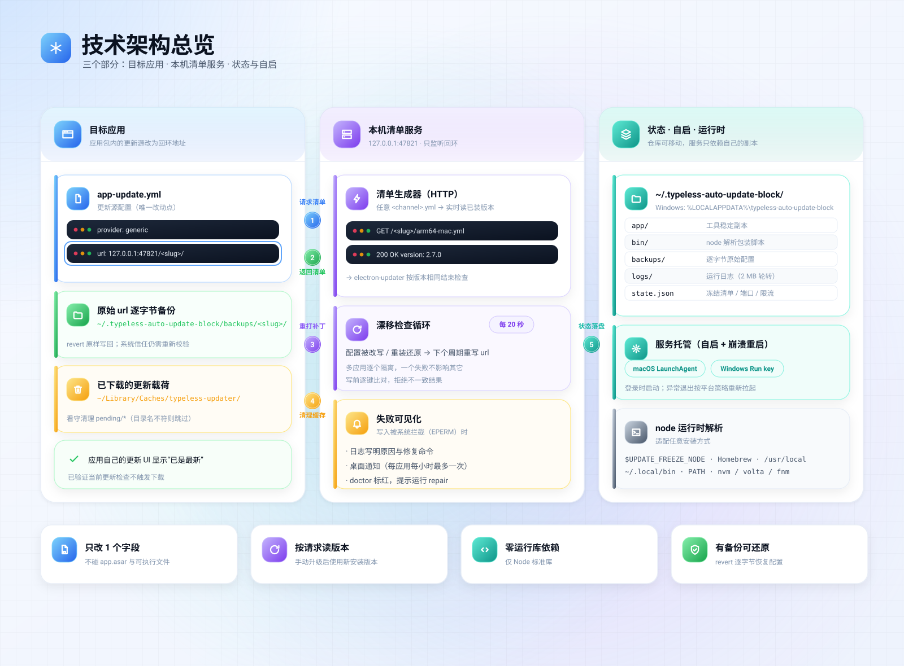
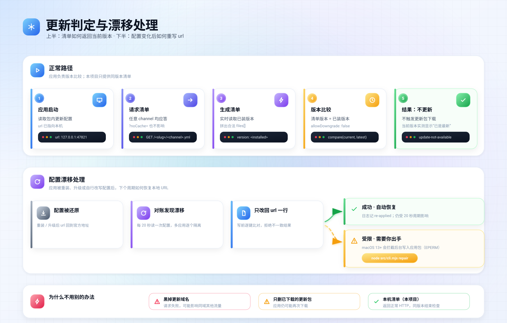

# Typeless 更新源控制器：实现架构

<p align="center">
  <a href="../README.md">English README</a> &nbsp;·&nbsp;
  <a href="../README.zh-CN.md">中文说明</a> &nbsp;·&nbsp;
  <b>本文：中文</b>
</p>

本文只说明仓库里的实现、实际写入范围和验证边界。Typeless 安装包的只读分析见
[typeless-technical-analysis.md](typeless-technical-analysis.md)。

| 项目 | 当前事实 |
| --- | --- |
| 控制对象 | 使用 `electron-updater` generic provider 的应用 |
| 持久化改动 | 应用包内 `app-update.yml` 的 `url` 一行；另有本地备份、状态和日志 |
| 本地服务 | Node.js 标准库 HTTP 服务，监听 `127.0.0.1` |
| 平台状态 | macOS + Typeless 2.7.0 已做真实验证；Windows 只完成代码与自动化覆盖 |
| 测试 | `node --test`：14 项通过（当前仓库测试集） |

## 1. 数据流



```text
scan → 识别 app-update.yml → dry-run → 备份并替换 url
                                      ↓
                       127.0.0.1 清单服务 + LaunchAgent/Run
                                      ↓
             应用请求清单 → 返回当前版本 → update-not-available
```

服务只绑定回环地址。它不读取或改写 Typeless 的模型请求、账号数据或业务数据库。

## 2. 组件边界

| 组件 | 文件 | 职责 | 失败表现 |
| --- | --- | --- | --- |
| CLI | `src/cli.mjs` | 参数解析、命令编排、状态输出 | 命令返回错误，不继续写入 |
| 发现器 | `src/discover.mjs` | 扫描应用、识别 electron-updater / Sparkle、读取版本 | 只读；Sparkle 仅报告 |
| 配置 | `src/config.mjs` | 解析扁平 YAML、单键替换、生成清单 | `freeze` 写入前比较非 `url` 键 |
| 补丁 | `src/patch.mjs` | 可写性检查、逐字节备份、还原 | 不可写或类型不支持时中止 |
| 守护进程 | `src/daemon.mjs` | HTTP 清单、漂移检查、缓存看守、通知限流 | 写入失败记日志并提示 `repair` |
| 服务托管 | `src/agent.mjs` | 工具副本、运行时 Node 包装脚本、LaunchAgent / Run | 安装后再次检查是否加载 |
| 状态 | `src/state.mjs` | 原子保存端口、应用和备份索引 | 读取损坏时回退空状态 |
| asar 读取 | `src/asar.mjs` | 仅在版本字段缺失时读取 `package.json` | 失败则使用已保存版本 |

## 3. 请求和版本判定



1. `freeze` 把 `url` 指向 `http://127.0.0.1:<port>/<slug>/`，不改变 provider、channel 或缓存目录字段。
2. 应用照常请求 `<channel>-mac.yml`、`latest.yml` 等路径；服务按第一段路径找到应用状态。
3. 服务读取安装版本：macOS 先读 `Contents/Info.plist`，Windows 读 `resources/app.asar`；必要时 macOS 也回退 `Contents/Resources/app.asar`。
4. 服务返回同版本清单。版本相同是 electron-updater 自己判定“不更新”的条件。
5. 守护进程每 20 秒再次检查配置。如果 URL 漂移，只替换 `url`；缓存看守仅在记录的目录名仍匹配时清理 `pending/` 文件。

这里没有“保证任何时刻都不会更新”的承诺：应用重装、权限变化和 20 秒对账窗口都可能造成短暂漂移；服务端也可以拒绝旧客户端。

## 4. 写入和恢复

```text
应用配置 ──freeze──> 本地 URL
     │                  │
     └──逐字节备份───────┘
     │
     └──revert──> 原始 URL
```

状态目录：

```text
~/.typeless-auto-update-block/                 %LOCALAPPDATA%\\typeless-auto-update-block
  app/                                          服务使用的工具副本
  bin/                                          Node 包装脚本
  backups/<slug>/app-update.yml                 原始配置
  backups/<slug>/meta.json                      路径、原 URL、时间
  logs/agent.log                                请求、重打补丁、错误
  state.json                                    端口、应用、缓存、通知时间
```

`revert` 只使用备份文件和 `meta.json` 中的路径。备份缺失，或当前配置的非 `url` 字段与备份不一致时，直接报错，不猜测原配置。

## 5. 平台和证据

| 维度 | macOS | Windows |
| --- | --- | --- |
| 应用位置 | `/Applications`、`~/Applications` | `%LOCALAPPDATA%\\Programs`、`Program Files`、`Program Files (x86)` |
| 配置文件 | `Contents/Resources/app-update.yml` | `resources\\app-update.yml` |
| 版本 | `Info.plist` → `app.asar` | `resources\\app.asar` |
| 自启 | `io.typeless-auto-update-block.agent` | `HKCU\\...\\Run` + `.cmd` |
| 证据 | Typeless 2.7.0 真机、UI、日志、守护进程 | 自动化测试；未做真实机验收 |

自动化测试验证的是仓库的函数和临时 fixture，不等于 Windows 真实安装环境验收。

## 6. 为什么采用本地清单

| 方法 | 可观察结果 | 主要代价 |
| --- | --- | --- |
| 本地清单 | 应用收到正常 HTTP 响应，并按版本相等结束更新检查 | 需要本地守护进程；修改应用包 |
| hosts / 防火墙 | 更新请求失败；可能影响同域其他请求 | 错误、重试和误伤范围不可控 |
| 只删除缓存 | 应用仍可能重新下载 | 只能处理已经出现的载荷 |
| 修改 `app.asar` | 可能破坏完整性和启动 | 变更面大，恢复复杂 |

本地清单减少了“请求失败”这一变量，但不等于应用不会记录其他遥测，也不改变其服务端业务请求。

## 7. 失败模式

| 情况 | 当前行为 | 用户动作 |
| --- | --- | --- |
| 端口被占用 | 从首选端口向后找最多 40 个端口，并更新已冻结应用 | 查看 `status` |
| 配置不可写 | CLI 明确报错；后台记录失败并限频通知 | 用有权限的终端执行 `repair` |
| 应用被重装 | 下个对账周期重新写入；备份仍指向原路径 | 必要时重新 `freeze` |
| 新版本改变配置字段 | 还原时拒绝覆盖旧字段 | 先确认新配置，再重新 `freeze` |
| 守护退出 | LaunchAgent / Run 按平台策略重新启动 | 用 `doctor` 检查 |
| 缓存目录名改变 | 跳过清理并写日志 | 人工确认后处理 |
| 更新清单路径未知 | 服务按应用 slug 处理任意文件名 | 查看 `agent.log` |

## 8. 验证方式

```sh
npm test
node src/cli.mjs scan
node src/cli.mjs freeze Typeless --dry-run
node src/cli.mjs status
node src/cli.mjs doctor
```

macOS 真实验证记录：Typeless 2.7.0 请求命中本地 feed，关于页显示“您已是最新版本”，没有新的待安装载荷。这个结果只覆盖当前安装、当前权限和当前版本。

## 9. 代码地图

| 文件 | 作用 |
| --- | --- |
| `src/cli.mjs` | 命令和输出 |
| `src/discover.mjs` | 应用与更新源发现 |
| `src/config.mjs` | YAML 单键替换和清单 |
| `src/patch.mjs` | 备份、补丁、还原 |
| `src/daemon.mjs` | 服务、对账、缓存看守 |
| `src/agent.mjs` | 后台服务与包装脚本 |
| `src/asar.mjs` | 版本读取回退 |
| `test/integration.test.mjs` | 14 项测试 |

## 10. 明确不负责的事情

- 不修改 `app.asar`、业务代码或模型提示词。
- 不读取、代理或解密 Typeless 的语音和上下文请求。
- 不保证服务端继续接受旧版本。
- 不把 Sparkle、其他更新框架或真实 Windows 行为描述成已验证。
